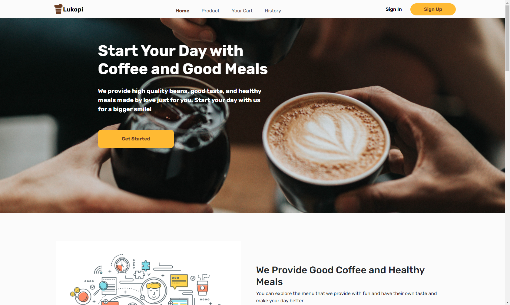
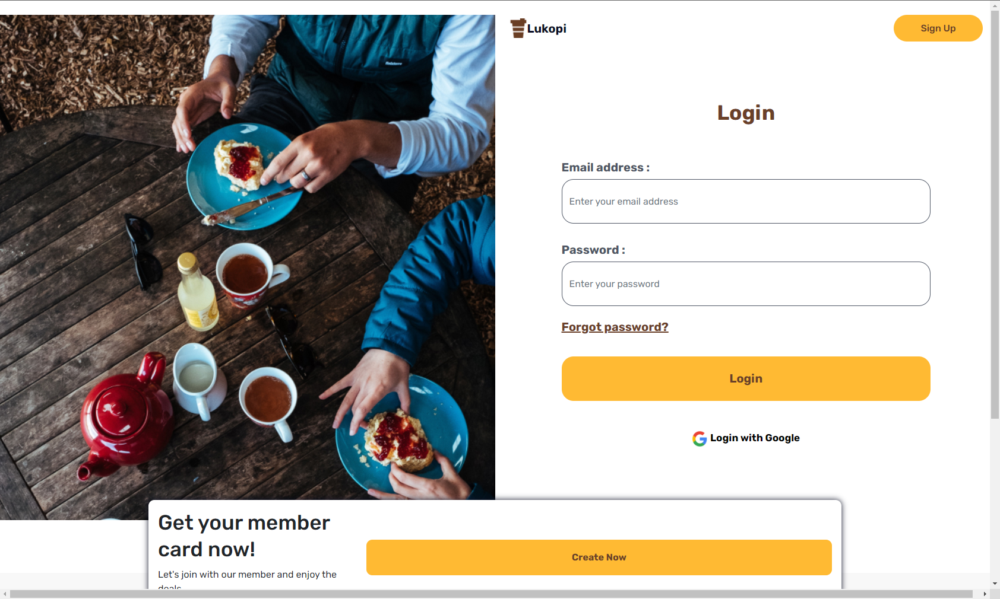
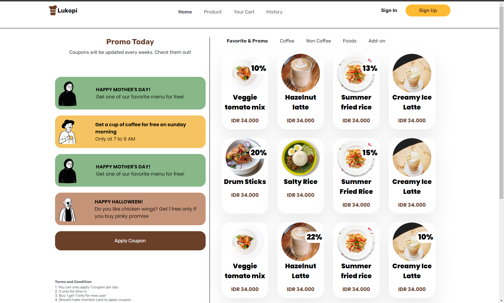

<h1 style="text-align:center">Lukopi - Coffee Shop</h1>

<div style="display:flex; justify-content:center">
    
</div>

## Built With


## How To Install

1. Clone the repository
   ```
   $ git clone https://github.com/Lukmandst/Lukopi-CoffeeShop-Client
   ```
2. Open [VS Code](https://code.visualstudio.com/)
3. Install [Live Server Extension for VS Code](https://marketplace.visualstudio.com/items?itemName=ritwickdey.LiveServer)
4. Right click _index.html_ then choose **Open With Live Server**

## Preview

<div style='display:flex;flex-direction:column;row-gap:10px;align-items:center'>



</div>

## Related Project

[Lukopi-CoffeeShop-BackEnd](https://github.com/Lukmandst/Lukopi-CoffeeShop)
